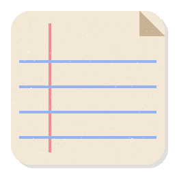

# PaperGrain

## 中文修改版

本仓库是 [CookieFilled/PaperGrain](https://github.com/CookieFilled/papergrain)
的个人修改版，保留原作者署名及 MIT 许可证。

- 默认简体中文，可在设置顶部或右键菜单中切换 English，语言选择会自动保存。
- 八种内置纸纹：细纸纹、棉质纸、素描纸、柔和书纸、再生纸、细纹水彩纸、宣纸、胶版印刷纸。
- 保留原版第一个细纸纹，移除粗牛皮纸、横线笔记纸及旧羊皮纸；仍支持自定义图片。
- 胶版印刷纸模拟微暖白、细密哑光的普通书页，不改变原有字体或排版。
- 纸纹仅提供视觉效果，不宣称医学护眼功效。

[下载 Windows 便携版（附完整源码）](https://github.com/lemonade12138/papergrain/releases/tag/v1.0.0-zh-paper.1)

解压后运行 `PaperGrain.exe`，在右下角程序图标的“纸张纹理”中选择纸张类型。


## English Overview

**Ultra-lightweight paper texture overlay for Windows 10/11.**
Native Rust · Win32 layered-window engine · zero runtime dependencies · MIT License.

PaperGrain overlays a subtle paper/grain texture across your screen to simulate
a paper reading and writing experience. The overlay is fully
**click-through** — it never intercepts mouse or keyboard input — and sits
quietly in the system tray with essentially zero idle CPU usage.

```
RAM (idle, 1080p)      ~12–18 MB     (target < 50 MB)
RAM (idle, 4K)         ~40 MB        (cached texture masters are freed when idle)
Installer size         < 1 MB        (target < 5 MB)
Cold start             < 0.5 s
Idle CPU               0%
Runtime dependencies   none          (no WebView2, no .NET, no VC++ redistributable)
```



## Features

- **Transparent full-screen overlay** (per-pixel alpha, click-through,
  always-on-top, no taskbar presence)
- **Eight procedural texture presets** — fine paper grain, cotton paper,
  drawing paper, soft book paper, recycled paper, fine watercolor paper,
  Xuan paper, and offset printing paper — generated at your monitor's native
  resolution and DPI
- **Language** — Simplified Chinese by default; switch instantly to English
  in Settings or the tray menu. The selection is saved across restarts.
- **Custom textures** — load any PNG / JPG / BMP / GIF (tiled if small,
  cover-scaled if large)
- **Adjustable opacity** — 10%–90% in 1% steps
- **Grain intensity** control per texture
- **Multi-monitor support** with per-display toggle
- **Global hotkey toggle** — default `Ctrl+Shift+P` (configurable in Settings)
- **System tray app** — right-click menu for everything; left-click opens
  Settings; survives Explorer restarts
- **Compact settings panel** with dark and light themes
- **"CookieFilled" watermark** — subtle, bottom-right corner, 5% opacity
  (can be disabled)
- **Auto-start with Windows** (optional, per-user registry entry)
- **DPI aware** — 100%–300%+ per-monitor scaling
- **No network access, no telemetry** — local JSON configuration only

## Install

### Setup (recommended)

1. Run `PaperGrain-Setup-1.0.0-x64.exe`
2. Follow the wizard (MIT license → components → install)
3. Optionally check *Launch PaperGrain* on the finish page

The installer registers a proper entry under
*Settings → Apps → Installed apps* with a working uninstaller.

### Portable

`PaperGrain.exe` is fully self-contained — copy it anywhere and run it. No
installation or elevation is required (auto-start writes to `HKCU` only).

## Usage

| Action | Result |
|---|---|
| `Ctrl+Shift+P` | Toggle the overlay on/off |
| Tray left-click | Open Settings |
| Tray right-click | Full menu (texture, opacity, monitors, exit…) |
| Settings → Browse… | Load a custom texture image |

**Note for screen sharing / recording:** layered overlay windows are captured
by DXGI-based tools (OBS, Teams, Discord). Toggle the overlay off
(`Ctrl+Shift+P`) before sharing your screen if you don't want the texture
recorded.

## Configuration

Everything lives in a single human-readable JSON file:

```
%APPDATA%\PaperGrain\config.json
%APPDATA%\PaperGrain\textures\    (copies of custom textures)
```

```json
{
  "version": 1,
  "language": "zh-CN",
  "enabled": true,
  "texture": "fine-grain",
  "opacity": 35,
  "intensity": 60,
  "monitors": { "\\\\.\\DISPLAY1": true },
  "hotkey": { "mods": "ctrl+shift", "key": "P" },
  "autoStart": false,
  "darkMode": true,
  "showWatermark": true
}
```

Corrupt or missing files are silently replaced with defaults — the app never
shows config errors.

## Why native Rust instead of Tauri/WebView2?

The project brief specified Tauri 2.0 but also specified hard limits of
**<50 MB idle RAM** and a **<5 MB installer**. The WebView2 runtime alone
spawns multiple processes totaling **100–250 MB** and ships ~100 MB of
runtimes — those two constraints are mutually exclusive. PaperGrain therefore
uses the same language (Rust) with a hand-written Win32 FFI layer
(see `src/win32.rs`, zero external crates) and a layered-window overlay
engine. Result: a ~420 KB executable that idles at a fraction of the RAM
budget, needs *no* WebView2 installation, and works on any Windows 10/11
machine out of the box.

Full engineering notes: [`docs/IMPLEMENTATION_NOTES.md`](docs/IMPLEMENTATION_NOTES.md)

## Building from source

### Windows (native, MSVC)

```
cargo build --release
```

The resource script (icon/manifest/version info) is optional on Windows;
without `rc.exe` in PATH the binary still runs with a runtime-generated icon.

### Linux (cross-compilation)

Requirements: [rustup](https://rustup.rs) with the
`x86_64-pc-windows-gnullvm` target, [LLVM-MinGW](https://github.com/mstorsjo/llvm-mingw),
and `makensis` (optional, for the installer):

```
rustup target add x86_64-pc-windows-gnullvm
windres assets/app.rc -O coff -o build/res.o
cargo rustc --release --target x86_64-pc-windows-gnullvm -- -C link-arg=$PWD/build/res.o
strip target/x86_64-pc-windows-gnullvm/release/papergrain.exe
```

A full reproducible build + packaging script is included at
`scripts/build_papergrain.sh` in the release bundle.

### Command-line switches

- `--smoke` — initialize everything, render one frame, and exit (CI/testing)

## Project layout

```
papergrain/
├── src/                 Rust sources
│   ├── main.rs          entry point, app state, message loop
│   ├── win32.rs         hand-written Win32 FFI (no external crates)
│   ├── overlay.rs       layered click-through overlay windows
│   ├── tray.rs          system tray icon + context menu
│   ├── panel.rs         settings panel UI
│   ├── textures.rs      procedural texture generators
│   ├── noise.rs         value noise / fBm
│   └── config.rs        JSON config + persistence
├── assets/              icon, manifest, version resources
├── textures/            preset previews (usable as custom textures)
├── installer/           NSIS setup script
├── tools/               icon/preview generators (Python)
└── docs/                engineering notes
```

## License

MIT — see [LICENSE](LICENSE). © 2026 CookieFilled

> This is an unsigned open-source build. SmartScreen may show
> "Windows protected your PC" on first launch — click *More info → Run
> anyway*, or build from source yourself.
